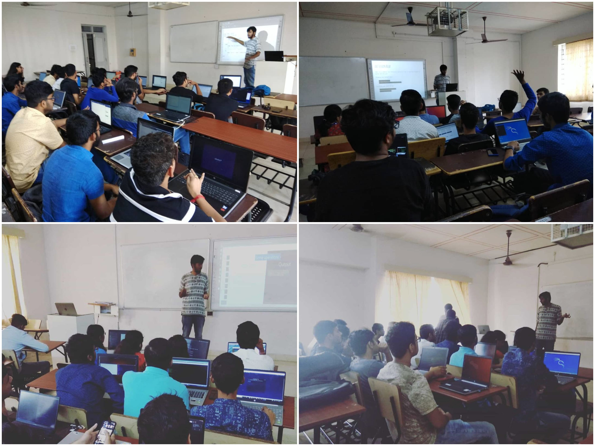

Recently I made two presentations on getting started with shell scrtipting and its applications. Answering questions like what is shell scripting? How will it be useful? How does one get started with shell scripting? 
This post is basically a written version of the presentation.

    VIT - Linux Users' Group - Session 1 and 2 [An Introduction to Shell Scripting]

I have also included answers to common questions I was asked during the presentation as well as some links for you to learn about shell scripting in depth.

If you want to refer to the slides I used during the presentation click <a href="https://docs.google.com/presentation/d/1BxEWMYGXlINu0lW3ezYdBXoR27obI8o1NYhnKtfBcs4/edit?usp=sharing">here</a>.

To be continued...
